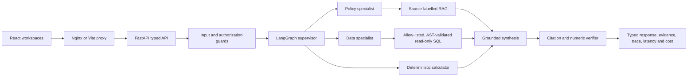

# Architecture

OpsGraph keeps language interpretation probabilistic while keeping permissions, SQL execution, exact calculations, evidence identifiers, tool budgets, and release gates deterministic and testable.

## Request path

The supervisor chooses a bounded route: RAG, SQL, hybrid, calculator, or unsupported. Specialists are roles inside one controlled graph, not autonomous chatbots. Each role receives only its authorized tools, and the graph enforces a maximum tool-call budget plus one bounded correction attempt.

## Trust boundaries

- The model can interpret a question and produce structured proposals or grounded prose.
- Application code validates tool authorization and the structured output contract.
- SQLGlot parses proposed SQL; allow-lists, single-statement enforcement, read-only execution, and row limits control database access.
- Python and Decimal/integer arithmetic own payroll and SLA calculations.
- Stable evidence IDs connect retrieval and SQL results to citations in the final response.
- The verifier rejects unknown citations, changed numeric facts, unsupported liability, unsafe SQL, and secret leakage.
- Evaluation hard failures block a release even when aggregate metrics look acceptable.

## Runtime profiles

| Capability | Free default | Optional path | Boundary |
|---|---|---|---|
| Model | Deterministic fake provider | Ollama or Amazon Bedrock | Provider switching does not change tools, permissions, or verification. |
| Retrieval | Hash embeddings plus FAISS | PostgreSQL with pgvector adapter | The live demo stays on FAISS; pgvector is exercised by an integration test. |
| Operational data | Synthetic SQLite | Replace behind the executor contract | Only the allow-listed semantic schema is queryable. |
| Telemetry | Bounded redacted local run records | OpenTelemetry Collector and Jaeger | Telemetry is opt-in and excludes raw secrets. |
| Evaluation | 40 deterministic synthetic cases | Repeated live-provider evaluation | The checked-in baseline is SHA-256-checksummed, not cryptographically signed. |

## Deployment boundary

The repository packages a repeatable local demonstration and CI release gates. It is not a deployed regulated service. Production use still requires enterprise identity and tenant isolation, managed secrets and storage, reviewed retention, provider quotas, durable graph state, incident response, live-model repeated evaluation, and formal legal/domain approval.
